人工智障入门指北 11.23.18.16

先看一眼cuda版本

我是11.1

装pytorch

https://pytorch.org/get-started/locally/

下面按那自己的cuda版本选择

然后把command粘进去安装 我是anaconda的 python3.8.3

然后去下数据集

http://www.cs.toronto.edu/~kriz/cifar.html

下python version

迅雷无敌了

这时候pip那边估计装好了

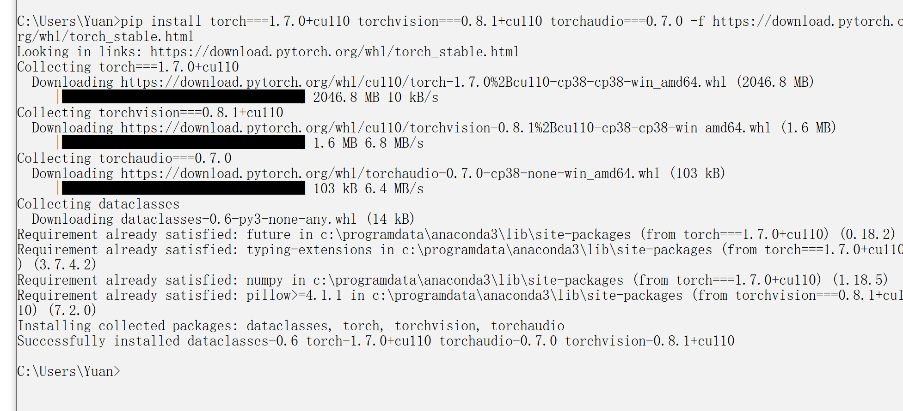

先来个resnet50吧

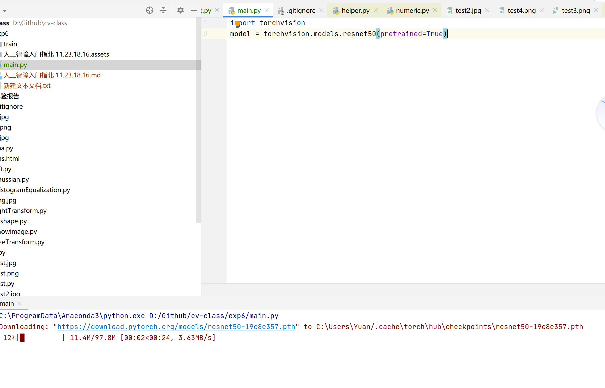

启动后会自动下载一下参数

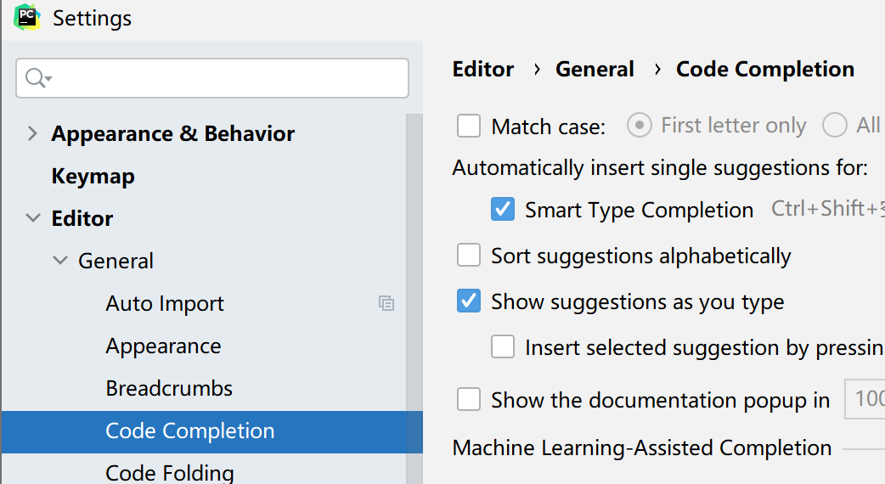

pycharm里取消一下自动补全区分大小写 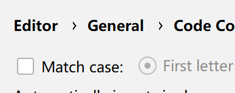

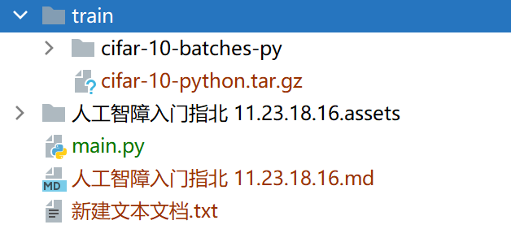

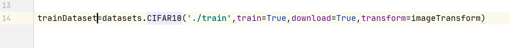

把刚才下的数据集扔到train下面

这玩意会自动帮你把cifar10的tar.gz弄好

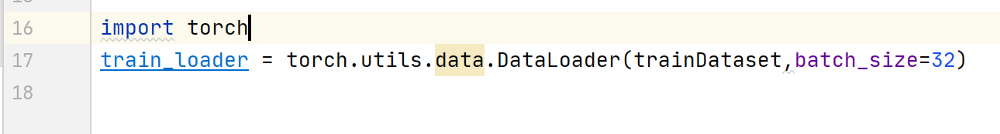

用dataloader 把数据集load进来 batchsize看你自己的显存调 调高了炸显存

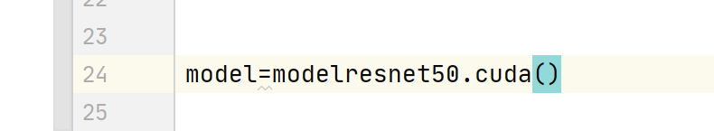

把模型转换到gpu上 

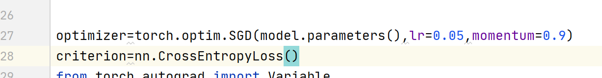

使用 随机梯度下降和交叉熵损失函数

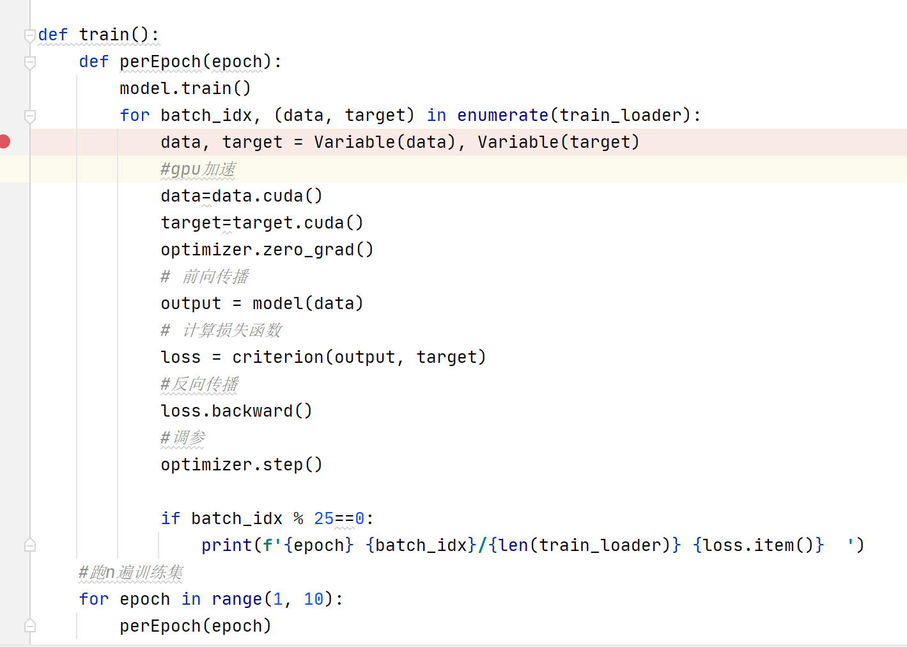

从训练集里拿到data target  就对应着网络输入 和理想结果

然后前向传播反向传播调参

直接启动 按理说可以跑了

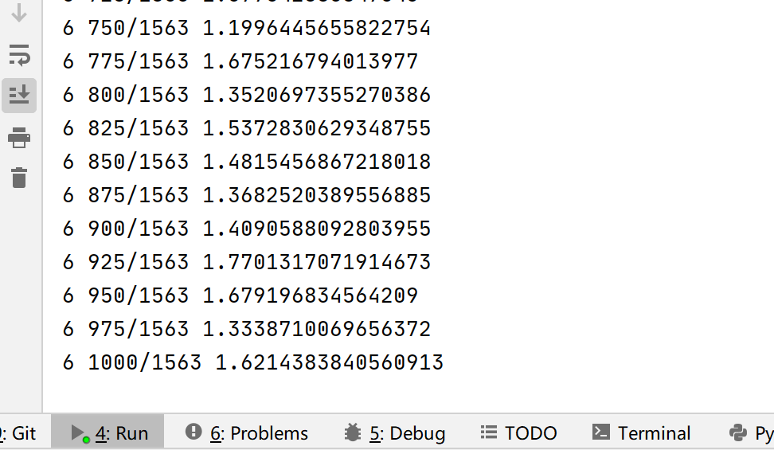

切到任务管理器看你的gpu cuda 

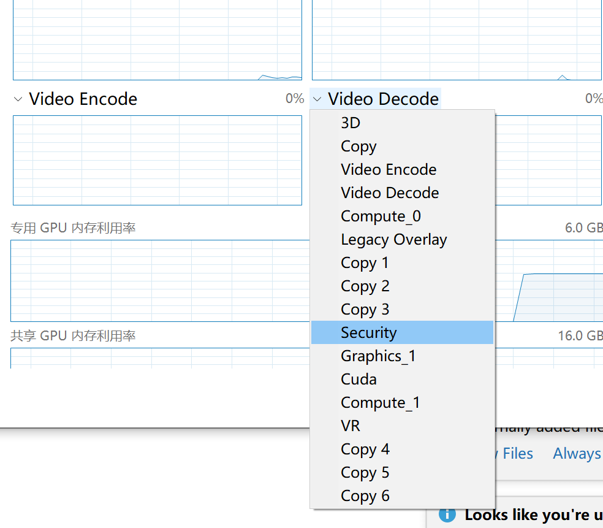

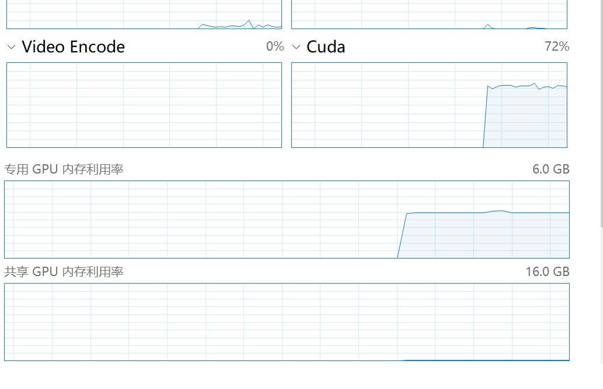

注意如果显存占用过高 或者报错了 去改batch_size

1660ti 用256的batch_size

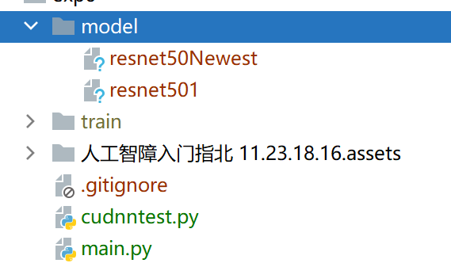

然后我们建一个model用来存训练好的模型

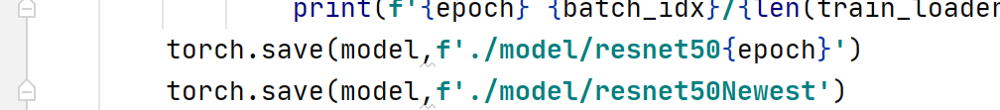

一个来存当前的训练结果 一个来存最新的训练结果

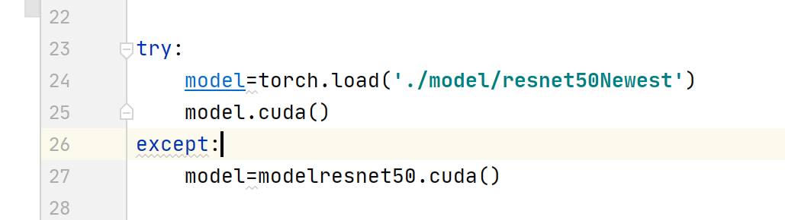

这样我们下次加载模型 就可以从最新的参数加载了

